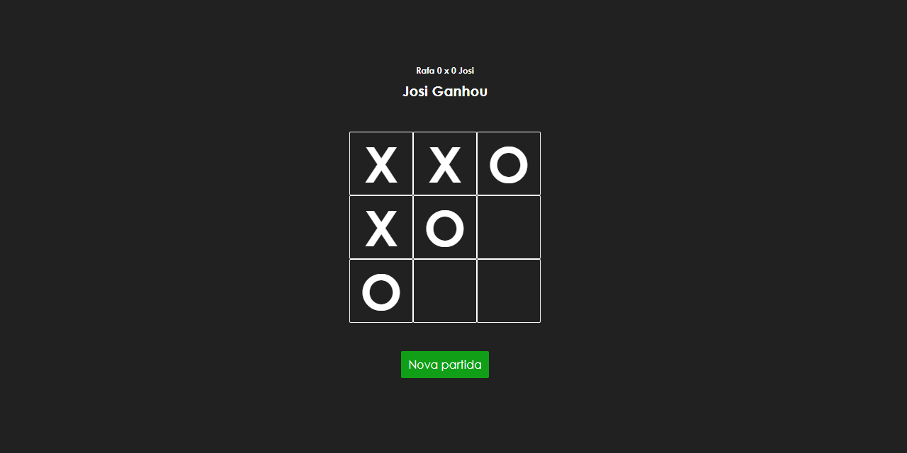

<h2>    
    Jogo da Velha
</h2>

    O famoso jogo da velha.

    
    
    
    
    
    

    <a href="#objective">Objetivo</a> •
    <a href="#technologies">Tecnologias</a> • 
    <a href="#author">Autor</a>

<h2> 
	✔️ Jogo da Velha 😃 Finalizado ✔️
</h2>

    
        

<h2 id='objective'>Objetivo</h2>

    Esse jogo foi feito para praticar React.js.

<h2 id='technologies'>
    Tecnologias
</h2>
<ul>
    <li>
        <a href="reactjs.org/">React.js</a>
    </li>
    <li>
        <a href="styled-components.com">Styled Components</a>
    </li>
    <li>
        <a href="sass-lang.com">Sass</a>
    </li>
</ul>

<h2 id="author">
    Autor: Rafael Couto
</h2>

    Desenvolvedor front-end júnior, apaixonado pela área e por resolver problemas.

<h2>Contatos:</h2>
<ul>
    <li>
        Telefone: <a href="https://api.whatsapp.com/send?phone=5524999644346">
            (24) 9 9964-4346
        </a> 
    </li>
    <li>
        Email: <a href="mailto:rafaelcsilva016@outlook.com">
            rafaelcsilva016@outlook.com
        </a>
    </li>
    <li>
        LinkedIn:
        <a href="linkedin.com/in/rcs-frontend/">
            Rafael Couto Silva
        </a>
    </li>
    <li>
        GitHub:
        <a href="gist.github.com/rafaelcsilvadev">
            rafaelcsilvadev
        </a>
    </li>
</ul>
