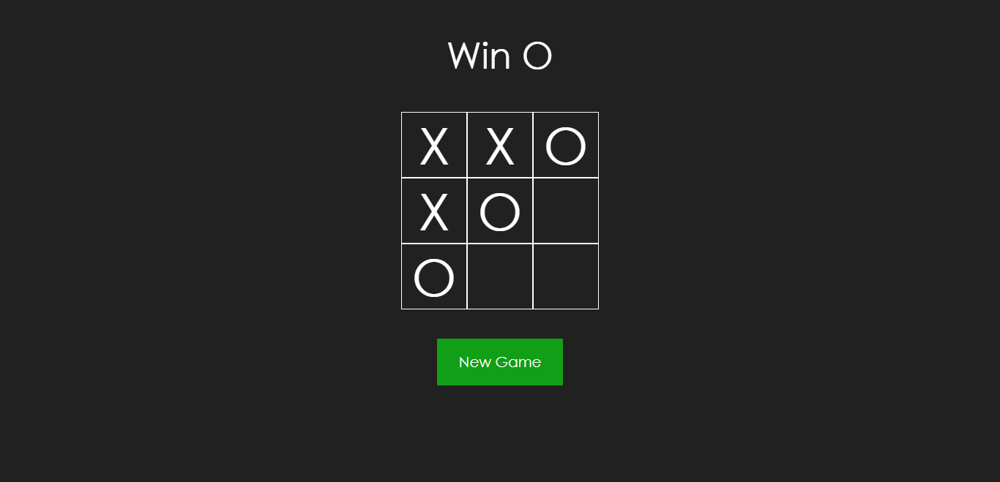

<body>
    <header align='center'>
        <h3>
            Tic-Tac-Toe
        </h3>        
    </header>
    <section>
        
        
        

           

                <h4>
                    Description:
                <h4>
           

            

                This game is a PWA made using HTML, CSS, React.js.
            

        
        
        

            

                <h4>
                    #Technologies
                 </h4>
            

            <ul>
                <li>
                    HTML
                </li>
                <li>
                    CSS
                </li>
                <li>
                    JS
                </li>
                <li>
                    JSX
                </li>
                <li>
                    React.js
                </li>
                <li>
                    ESLint
                </li>
                <li>
                    Prettier
                </li>
            </ul>    
        

        

            

                <h4>
                    #Future Upgrades
                 </h4>
            

            <ul>
                <li>
                    Show a message of tied game.
                </li>
                <li>
                    Show players name.
                </li>
                <li>
                    Show score.
                </li>
                <li>
                    Modify New Game button for Clean button.
                </li>
                <li>
                    Change CSS for Styled Components.
                </li>
                <li>
                    Create Light and Dark mode.
                </li>
            </ul>    
        

        

            <a  href="https://rafael-tic-tac-toe.herokuapp.com/">Project Link</a>
        

    </section>
</body>
